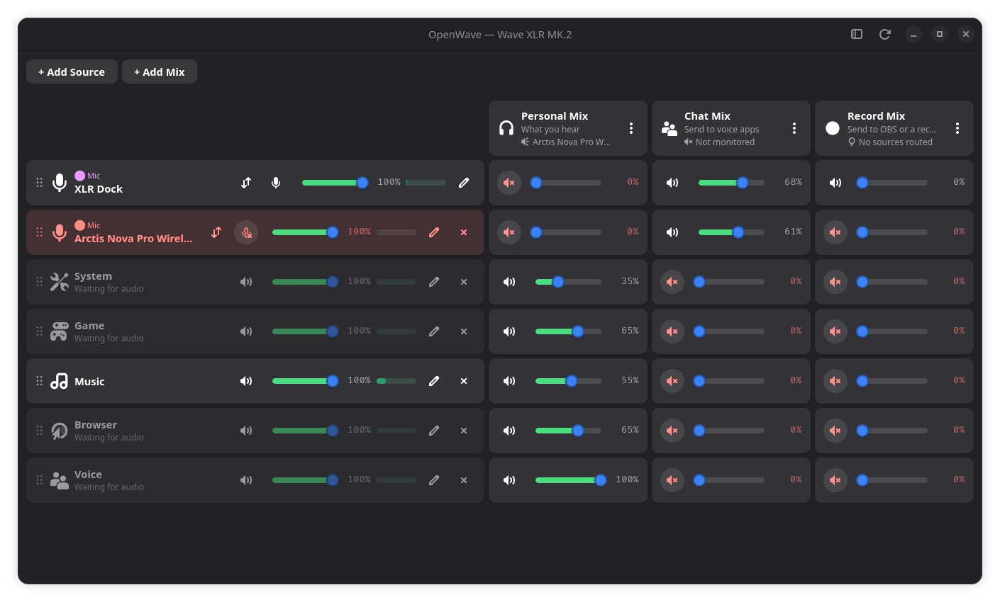

# OpenWave

**The audio mixing matrix for Linux.** Per-app mixes with per-mix outputs, plus native control of **Elgato Wave** hardware — the **Wave XLR** interface (original and MK.2/XLR Dock) and the **Wave:3** microphone. A reverse-engineered replacement for Elgato Wave Link, built with GTK4 + Adwaita.



Sources are rows, mixes are columns, and each cell is how much of that source
the mix receives. Above: an XLR Dock and an Arctis headset microphone grouped
so only one is live at a time — the muted one is the red row — feeding a
Personal Mix monitored on the headset, a Chat Mix published as a capture source
for voice apps, and a Record Mix routed nowhere but still recordable.

## Supported devices

| Device | USB ID | Controls |
|---|---|---|
| Wave XLR | `0fd9:007d` | Gain, mute, headphone volume, low impedance mode, **48 V phantom power** |
| Wave XLR MK.2 | `0fd9:00a6` | as the Wave XLR — it enumerates as "Elgato XLR Dock" and speaks the same vendor protocol |
| Wave:3 | `0fd9:0070` | Gain, mute, headphone volume, monitor mix |

Phantom power lives at offset 6 of the Wave XLR config block (`0x01` on,
`0x00` off), found by diffing the block across a toggle and confirmed against
the device's own +48V indicator. The Dock has no front-panel button for it at
all, so on that hardware the app is the only way to switch it.

## Features

- **Mixing matrix** — user-defined mixes as columns, sources as rows. Each cell
  is how much of that source the mix receives; each source row carries a trim
  applying everywhere. See [docs/ARCHITECTURE.md](docs/ARCHITECTURE.md).
- **Sources** — an application matched by name (several names per row, so one
  fader can cover every game or two music players), or a hardware capture
  device such as a headset microphone. One row may be the catch-all for
  anything unmatched.
- **Levels survive a reboot** — a mix master is a plain PipeWire sink volume,
  and the mix sinks are `context.objects` in PipeWire's own configuration, so
  the daemon recreates them at unity on every start and WirePlumber does not
  restore them: they are neither streams nor devices it manages. OpenWave
  remembers them itself and puts them back.
- **Per-mix output** — every mix chooses its own output device, or none at all
  for a mix that exists only to be captured. A mix keeps playing when the
  window is closed.
- **Microphone rows appear by themselves** — every Elgato capture input gets a
  row named after its device ("XLR Dock", "Wave XLR"), so two interfaces
  connected at once are told apart instead of contending for a single
  "microphone" row. They cannot be deleted, only muted.
- **Microphone groups** — drag one microphone row onto another to group them.
  Only one member of a group is live at a time and a single button hands the
  group over to the next, which is what two microphones on one speaker
  actually want; microphones in another group are untouched, so a second
  speaker's microphone stays open. Two mics on one person and one on another
  is two groups.
- **Sensible defaults** — System, Game, Music, Browser and Voice rows ship
  pre-matched to the usual applications, with System as the catch-all.
- **Remote control** — mixes, source trims and microphone groups are drivable
  from outside the window over the session bus. See
  [Remote control](#remote-control).
- **Microphone controls** — Gain, mute (syncs with hardware button), 48 V
  phantom power
- **Headphone controls** — Volume (syncs with hardware knob), low impedance mode
- **Hardware sync** — 10 Hz polling keeps the app in sync with physical controls
- **System integration** — Mute and HP volume sync bidirectionally with PipeWire/ALSA
- **Audio capture fix** — a background daemon (systemd or runit) prevents the
  firmware race where the microphone goes silent, and OpenWave itself
  **reopens a capture device that has stalled**: replugged while the system is
  running, a Wave comes back reporting itself unmuted at full gain with
  phantom on, and delivers no audio frames at all. Every layer says it is
  healthy, so nothing notices. See [Stalled capture](#stalled-capture).
- **System tray** — Runs in background with tray icon, mute from tray menu
- **First-run setup** — Configures udev permissions and audio service automatically

## How it works

Wave devices use USB Class control transfers on endpoint 0 for device configuration. On Linux, `snd-usb-audio` normally blocks these transfers because `wIndex=0x3300` routes through interface 0 (owned by the audio driver). OpenWave uses `wIndex=0x3303` instead — the firmware only checks the `0x33` prefix, while the kernel sees interface 3 (unclaimed) and lets the transfer through. No driver detach needed, audio is never interrupted.

Both devices speak the same vendor protocol (`bRequest` 0x85 read / 0x05 write) but with different config layouts: the Wave XLR uses a 34-byte block (gain uint16 @0, mute @4, HP volume int16 Q8.8 @9, knob mode @14, low-Z @33), the Wave:3 a 16-byte block (gain uint16 Q8.8 dB @0, mute @4, HP volume int16 Q8.8 @7, monitor mix uint16 Q8.8 percent @10, dial mode @12 — 1=gain, 2=headphones, 3=mix). Per-model constants live in `wavexlr/profiles.py`; `python3 -m wavexlr.probe` (`dump` / `watch` / `poke`) verifies a device against its profile and helps map new fields. The device services vendor transfers from only one process at a time, so quit OpenWave before probing.

## Mix levels and reboots

A mix master is a plain PipeWire sink volume, and the mix sinks are
`context.objects` in PipeWire's configuration — recreated by the daemon on
every start, at unity, with no memory. WirePlumber does not restore them
either, because they are neither streams nor devices it manages. Left alone,
every mix master silently resets to 100% at each boot, including anything set
from a control surface.

OpenWave remembers them in `mixes.json` under `volumes` and applies them once
the sinks exist. It records what the master is actually set to rather than
only what its own window did, because anything may move it — a Stream Deck,
`pavucontrol`, a media key — and whoever moved it, that is the value that
should come back.

Observation is gated on the restore having happened, and that gate is the
point rather than an optimisation. At boot the sinks exist at unity before
OpenWave does; an observation landing first would persist that unity and
destroy the value it exists to protect — silently, exactly once per boot,
which is indistinguishable from never having saved anything.

## Stalled capture

A Wave replugged while the system is running enumerates, gets its ALSA card
and its PipeWire node, reports itself unmuted at full gain with phantom power
on — and produces nothing. Not quiet audio: no frames.

The distinction that makes it detectable is **silence versus no data**. A live
analogue input always delivers a noise floor; a stalled one delivers nothing,
so a meter reading it blocks forever on its first read. That is the signal
OpenWave watches, and it is why a level threshold would be the wrong test — a
muted microphone in a quiet room is legitimately near zero and must not be
"recovered".

The remedy is to make ALSA close and reopen the device, which cycling the
card's profile through `off` and back does. Restarting the capture keepalive
does not: it exists to *prevent* the race and cannot clear one that has
already happened.

Three things it deliberately will not do. It will not act on a device that is
simply absent — unplugged is not broken, and cycling a card for a device
someone has just removed fights the person who removed it. It will not act on
silence reported by a dead meter subprocess, whose silence says something
about `pw-cat` and nothing about the hardware. And it gives up after two
attempts, because cycling a card is disruptive and a device that is genuinely
broken should be left alone to be noticed rather than reopened every minute
forever. Unplugging resets that budget, since replugging is how the stall
arises in the first place.

## Remote control

OpenWave exports a small set of actions on the session bus, so a control
surface can drive the parts of it that PipeWire alone cannot reach — the
window owns the mixer state, and the GUI holds the only USB handle the
firmware will serve.

There is no protocol of its own: `GApplication` already exports
`org.gtk.Actions` on `com.github.openwave`.

```console
$ gdbus call --session --dest com.github.openwave \
    --object-path /com/github/openwave --method org.gtk.Actions.List
(['switch-group', 'set-source-level', 'toggle-source-mute',
  'set-cell-level', 'toggle-cell-mute', 'source-groups', 'snapshot'],)
```

| Action | Parameter | Does |
|---|---|---|
| `switch-group` | `s` group name | Hands a microphone group to its next member |
| `set-source-level` | `(sd)` id, 0–1 | Sets a source's trim |
| `toggle-source-mute` | `s` id | Flips a source's mute, group rules included |
| `set-cell-level` | `(ssd)` source, mix, 0–1 | Sets one send — how much of a source a single mix receives |
| `toggle-cell-mute` | `(ss)` source, mix | Flips one cell's mute |
| `source-groups` | — | State: group names worth switching between |
| `snapshot` | — | State: every source, mix and cell, as JSON |

The two read-only actions publish their answer as action *state* rather than
returning it: `Activate` has no reply, but `Describe` reads state and `Changed`
fires when it moves, so a reader can both poll and subscribe. Activate first to
refresh, then describe.

`snapshot` is one action rather than one per field because a remote control
draws all of it on a single button, and reading it piecemeal would let the
parts disagree mid-read. It reports **every** cell, including the ones at zero:
a caller cannot otherwise tell a send that is down from one that does not
exist.

Everything goes through the window rather than the config files. `Mixer` holds
the same dict the window holds and rewrites `sources.json` whole on every save,
so a caller writing that file directly is overwritten the next time a fader
moves — and a cell written straight to `mixes.json` is undone even faster,
because `send × trim` is re-applied on every reconcile.

[**openwave-streamdeck**](https://github.com/NyleGarcia/openwave-streamdeck) is
a Stream Deck plugin built on this.

## Install

Tagged releases on the [Releases page](../../releases) carry ready-made
objects: a `.deb` for Debian/Ubuntu (`sudo apt install ./openwave_*.deb`),
a source tarball, and checksums.

One-liner — detects Arch, Debian/Ubuntu, Fedora, openSUSE, or Void; installs deps and OpenWave:

```bash
curl -fsSL https://raw.githubusercontent.com/rikkichy/openwave/main/install.sh | sh
```

Or from a checkout:

```bash
git clone https://github.com/rikkichy/openwave.git
cd openwave
./install.sh                  # default PREFIX=/usr/local
PREFIX=/usr ./install.sh      # for packaging-style layout
```

Uninstall:

```bash
sudo make -C /path/to/openwave uninstall PREFIX=/usr/local
```

### Requirements

- Python 3.10+
- GTK4, libadwaita
- PipeWire (for audio capture fix)
- libusb 1.0
- python-xlib *(optional)* — friendlier app names in the Add Source picker
  for X11/XWayland apps that report a generic PipeWire name ("ALSA plug-in
  [java]"); without it those rows fall back to the raw name

## Usage

```bash
openwave            # if installed via install.sh / PKGBUILD
python3 -m wavexlr  # from a checkout, no install needed
```

On first launch, OpenWave will prompt to set up USB permissions (via polkit) and install the audio service.

### Init systems

OpenWave detects your init system at runtime:

- **systemd** — the GUI installs a user unit at `~/.config/systemd/user/openwave.service` and enables it. No root needed for install or status checks.
- **runit** (Artix, Void, Devuan-runit) — the GUI cannot install the system service itself (writing to `/etc/sv` requires root). Create a `wavexlr-audio` service directory at `/etc/sv/wavexlr-audio/` whose `run` script execs `python3 -m wavexlr.daemon` as your user (typically via `chpst -u`), then enable it with `ln -s /etc/sv/wavexlr-audio /var/service/`.

  Status detection from the non-root GUI uses `sv check`; on stock Void the supervise FIFO is mode 0700, so OpenWave falls back to scanning `/proc` for the daemon process.

- **other** (macOS, Windows, no init detected) — the capture-fix section is disabled.

### App drawer, starting at login, starting in the tray

All three are handled by the app; none needs a file copied by hand.

The **app drawer entry** is written on launch to
`~/.local/share/applications/openwave.desktop`, and rewritten if it goes
stale — the `Exec` line records where OpenWave was found, so an entry written
from a checkout that has since been installed properly would otherwise keep
launching a path that no longer exists.

**Start at login** and **Start in the tray** are switches in the sidebar,
under *Startup*. Starting in the tray needs a tray: GNOME ships no
StatusNotifier host, so without an AppIndicator extension OpenWave shows its
window instead of hiding into nothing, and closing the window quits rather
than making it disappear. They write `~/.config/autostart/openwave.desktop`, adding
`--hide` for the tray-only case. Turning autostart off deletes that file;
the drawer entry is a separate file and is left alone.

Both are user-level files needing no privileges, which is why neither is part
of the first-run setup that asks for a password. An entry a desktop
environment has disabled in place (GNOME Tweaks does this rather than
deleting it) reads back as off, so the switch cannot claim a login behaviour
that will not happen.

`--hide` still works on its own for a one-off:

```bash
python3 -m wavexlr --hide
```

## Architecture

```
wavexlr/
  device.py   — USB backend (raw libusb via ctypes, wIndex=0x3303 trick)
  profiles.py — per-model protocol constants and capabilities
  probe.py    — vendor protocol verification CLI (dump / watch / poke)
  app.py      — GTK4/Adwaita UI with 10Hz polling
  tray.py     — StatusNotifierItem tray icon via D-Bus
  audio.py    — PipeWire capture keepalive (fixes firmware race condition)
  daemon.py   — Systemd service entry point
  setup.py    — First-run udev + systemd setup, generated PipeWire config
  mixer.py    — The router: intake sinks, per-cell loopbacks, stream claiming
  mixes.py    — Mix definitions store (~/.config/openwave/mixdefs.json)
  sources.py  — Source definitions store (~/.config/openwave/sources.json)
  mixmatrix.py  — The sources x mixes grid widget (drag to reorder or group)
  mixdialog.py  — Create/rename a mix
  sourcedialog.py — Add or edit a source
  meter.py    — Level metering via pw-cat
  service.py  — systemd/runit unit management
  paths.py    — Install-prefix resolution
```

[docs/ARCHITECTURE.md](docs/ARCHITECTURE.md) explains the routing model: why an
application's audio is moved rather than copied, how trim and send compose, and
why every stream gets exactly one owner.

## Development

Run from a checkout without installing:

```bash
python3 -m wavexlr
```

The tests cover the backend — matching, the stores, state migration, the
generated config and the device scaling. They import neither GTK nor a running
PipeWire, so they need no display, no audio server and no hardware:

```bash
python3 -m unittest discover -s tests -t .
```

The GUI, the USB protocol and the routing itself are not unit-tested; those are
verified against real hardware. `python3 -m wavexlr.probe dump` reads a
connected device and is the fastest way to check a profile — quit OpenWave
first, since the firmware serves one process at a time.

## Credits

USB protocol reverse-engineered from the macOS Wave Link application using Frida. Inspired by [GoXLR-on-Linux/goxlr-utility](https://github.com/GoXLR-on-Linux/goxlr-utility).

Several ideas and two modules are ported from
[CryoByte33/openwave](https://github.com/CryoByte33/openwave), a sibling fork:
the friendly-app-name resolution (`wmnames.py` and the generic-name rules),
the slider `Throttler` and its scheduler seam, ALSA control discovery by
name suffix, the hotplug reconnect loop, and the duplicate-source picker
guard. cryobyte33's fork also decoded the Wave XLR MK.2 (`0fd9:00b6`) vendor
protocol, which this tree defers only for lack of that hardware.

## License

MIT
